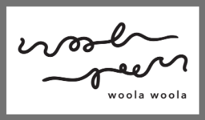

# User Centric Front-End Development - Milestone Project 1

 
### Website for Business Entity - Woola Woola

# Table of Contents
1. Background
2. Objectives
3. Demo
4. Adopted Technology
5. Building Process
6. Testing
7. Deployment
8. Acknowledgement

# 1. Background
Woola Woola is an existing small business entity founded by Jean Tan, a friend of mine. It is an accessorized earrings store, which currently has social media presence as its only channel of marketing, communication and business transaction. As a strategic planning for future expansion, Woola Woola requires a website to showcase its business and products, and subsequently, a platform for communication and an online store. Due to the process of learning, the website will not be able to support the communication platform and online store at the moment.

# 2. Objectives
* To complete Milestone Project 1 - User Centric Front-End Development.
* To showcase Woola Woola as a business entity.
* To market the business concept by providing information on its founding, vision, and products.

# 3. Demo
View the end product: [Woola Woola](https://farhansam.github.io/woolawoola)

# 4. Adopted Technology
* HTML/CSS
* Bootstrap v4.5
* Canva
* Github

# 5. Building Process

## User Stories
The target audience for the website are existing as well as potential customers of Woola Woola. Some of the questions that users might ask are:

1. What is Woola Woola and its concept?
2. What is the vision?
3. How was it founded?
4. What are the different product range available?
5. How can we keep in touch?

In this respect, the website was built in response to these questions. Hence, the following pages were created:

1. Landing page to introduce Woola Woola.
2. "The Story" page to demonstrate the vision and tell the story of Woola Woola from the founder's prespective.
3. "Our Collections" page to market the current range of products.
4. "Contact Us" page (static) to allow customers to keep in touch. Links to the existing social media platforms are also provided.

## Key Features and its Assimilation to User Stories
### 1. Navbar
* To allow users to navigate through different pages seamlessly and from within any page.
### 2. Carousel Images
* To cycle through different images of different product range. 
* Adds on to the user-centric element of seamlessness.
### 3. Feedback Form & Social Media Links
* To allow users to keep in contact with the business.
### 4. Mobile Responsiveness
* To accommodate to users of mobile phones who prefer to visit websites on-the-go.

# 6. Testing
All HTML and CSS files were passed through W3C Nu HTML and Jigsaw CSS validators respectively. Files were uploaded to the validators and all errors were fixed.

# 7. Deployment
The website was deployed through Github pages.
* Link to published website: (https://farhansam.github.io/woolawoola)

# 8. Acknowledgement
* Trent Global College for providing the platform for learning.
* Code Institute for their TAs, namely:
  * Arif Rawi
  * Malcolm Yam
  * Shun
  * Paul
* Jean Tan, Founder of Woola Woola for her resources.
* [By Invite Only](https://www.byinviteonly.info/) for the main source of inspiration. 

